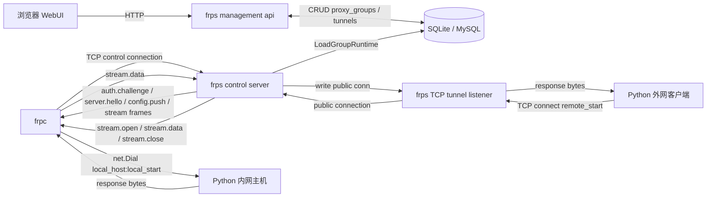
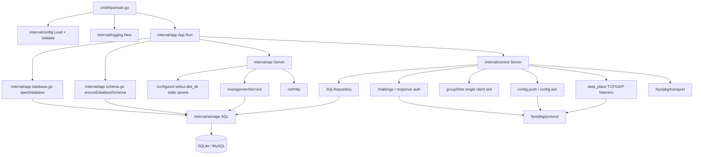
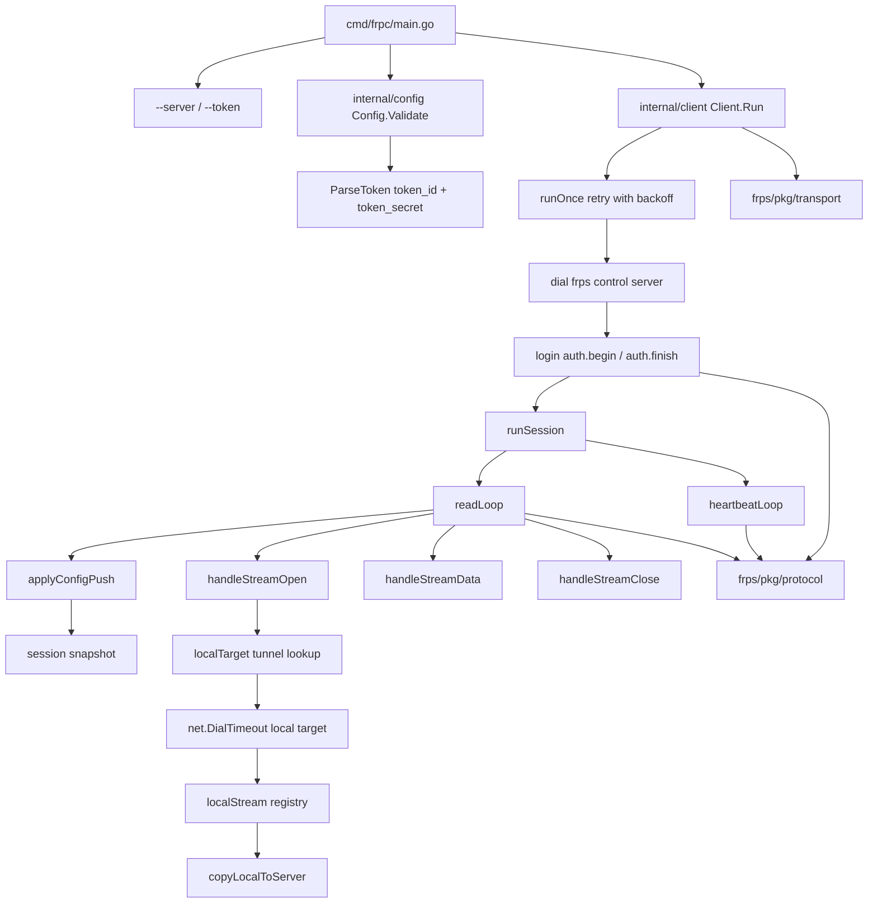
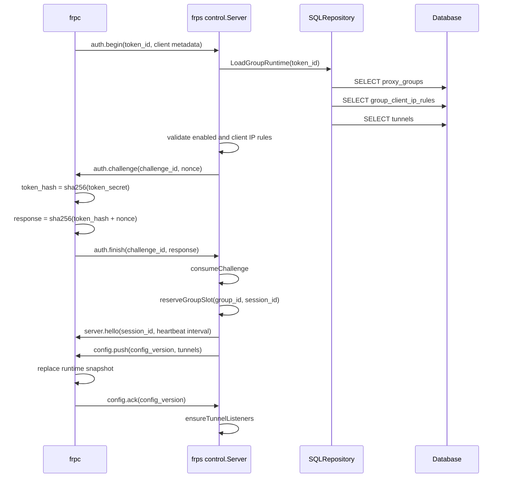
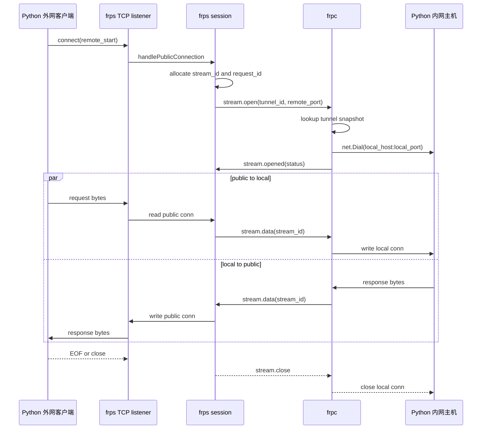
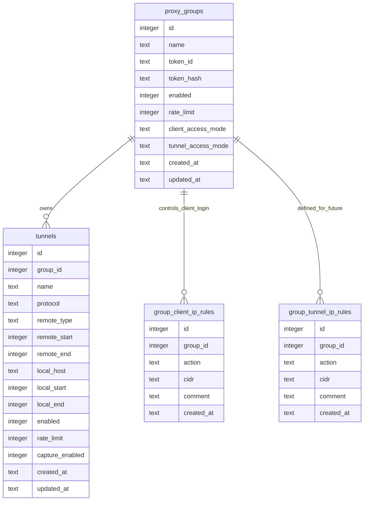

# frps / frpc 当前代码架构图

本文根据当前代码实现绘制，不包含尚未落地的设计目标。代码现状以 `2026-04-19` 的工作区为准。

## 1. 总体运行拓扑

当前已完整跑通的主链路是：

```text
Python 外网客户端 <-> frps <-> frpc <-> Python 内网主机
```



核心边界：

- `frps` 同进程内同时运行管理面 HTTP 服务和 `frpc` 控制连接服务。
- `frps` 的公网隧道监听器由控制会话在收到 `config.ack` 后启动。
- `frpc` 只通过 `--server` 和 `--token` 启动，不保存复杂隧道配置。
- 当前数据面把多个 stream 复用在同一条 `frpc <-> frps` 控制 TCP 连接上，没有单独工作连接池。
- UDP 当前已经具备 `frps` 公网 listener、控制帧桥接、`frpc` 本地 UDP 转发、`frps` 侧空闲 `30s` cleanup，以及 Python happy path / idle cleanup e2e。

## 2. frps 进程内架构



主要职责：

- `cmd/frps/main.go`：零参数启动，固定读取当前工作目录下的 `data/config.json`，加载配置和日志，启动 `app.App`。
- `internal/app`：打开数据库，执行当前必需表建表 / 校验，并并发启动管理面和控制面。
- `internal/api`：提供内嵌 WebUI、健康检查、分组 CRUD、隧道 CRUD、token 重置。
- `internal/control`：处理 `frpc` 登录、challenge/response、单分组单客户端槽位、配置下发、心跳、TCP 单端口/范围 stream 转发，以及 `frps` 侧 UDP listener/session 管理。
- `internal/storage`：包装已打开的 `*sql.DB` / `*sql.Tx`，提供统一查询、执行、事务接口。
- `pkg/protocol`：定义业务帧、消息类型、错误码、隧道结构和编解码。
- `pkg/transport`：定义 4 字节长度前缀帧读写、超时和最大帧限制。

## 3. frpc 进程内架构



主要职责：

- `cmd/frpc/main.go`：只接收 `--server` 和 `--token`，日志级别通过 `FRPC_LOG_LEVEL` 控制。
- `internal/config`：校验 server 地址，按固定长度解析 token 为 `token_id` 和 `token_secret`。
- `internal/client.Client`：连接 `frps`、登录、断线退避重连、启动读循环和心跳循环。
- `sessionState`：保存配置快照、活跃 stream、心跳间隔、已确认配置版本和写锁。
- `streams.go`：收到 `stream.open` 后按隧道快照拨号本地目标，并把本地 TCP 连接和远端 stream 帧互相转发。

## 4. 登录和配置下发时序



实际代码约束：

- 数据库保存的是 `token_id` 和 `token_hash`，不会保存 token 原文。
- `frpc` 使用 token 原文中的 `token_secret` 计算响应，`frps` 使用数据库中的 `token_hash` 验证响应。
- `frps` 内存中的 `groupSlots` 固定表示每个分组只有一个已登录客户端槽位。
- 当前配置快照在登录时加载并下发；管理面修改数据库后，当前代码没有把变更主动推送给已在线 `frpc` 的热更新通道。

## 5. TCP 转发时序



当前实际数据面边界：

- `frps` 会为 `enabled` 的 TCP 单端口 / range 隧道，以及 `enabled` 的 UDP 单端口 / range 隧道启动公网 listener。
- `frps` 当前已经能把公网 UDP datagram 按 `tunnelId + remotePort + 公网客户端地址` 绑定到 `sessionId`，并向 `frpc` 顺序发送 `udp.open` / `udp.data`，同时接收来自 `frpc` 的 `udp.data` 回写公网客户端。
- `frps` 是 UDP session 生命周期的唯一裁决方；当前会在公网收包和 `frpc` 回包时立即刷新 UDP session 活跃时间，并由后台每 `1s` sweep 一次空闲会话，在“最后一次成功双向转发后空闲约 `30s`”时删除本地 session、向 `frpc` 发送 `udp.close`。
- `frpc` 当前会在收到 `udp.open` 后按 `sessionId` 建立真实本地 `UDPConn`，收到 `udp.data` 后把 datagram 写到本地 UDP 服务，并由后台读循环把本地响应按同一 `sessionId` 回发给 `frps`。
- `frpc` 当前不做本地 idle timer；只有在收到 `udp.close`、发生本地不可恢复读写错误，或控制会话结束时才释放本地 UDP session。
- TCP range 当前已经完成最小闭环：`config.ack` 后会按 `remoteStart..remoteEnd` 展开 listener，把实际命中的公网端口写入 `stream.open.remotePort`，并已由 `test/e2e_tcp_range.py` 验证同一个 range tunnel 命中不同 `remotePort` 时会按偏移转发到对应 `localPort`；`test/e2e_tcp_single.py` 的 `happy_path` 也已重新通过。UDP 当前已经完成“公网入口、本地转发、`frps` `30s` idle cleanup、`frpc` 收口，以及 Python happy path / idle cleanup e2e”的最小闭环；同时，UDP range 的 `frps` 入口已经进入真实运行态：`config.ack` 后会按 `remoteStart..remoteEnd` 展开 UDP listener、把实际命中的公网端口写入 `udp.open.remotePort`，并按 `tunnelId + remotePort + public client addr` 区分 session。当前仍未完成的是 `frpc` 的 UDP range 本地端口映射、最小 Python e2e，以及范围链路总回归；隧道入口 ACL、限速、抓包、在线观测等能力也仍未进入真实执行链路。

## 6. 数据库模型关系



说明：

- 关系图表达的是当前代码中的逻辑关联，schema 中未声明外键约束。
- `proxy_groups` 和 `tunnels` 是当前 WebUI 和控制面共同使用的核心表。
- `group_client_ip_rules` 已被 `frps` 登录校验读取。
- `group_tunnel_ip_rules` 当前只在 schema / 删除依赖中出现，数据面未使用。
- 当前代码不维护 `schema_migrations` 或独立 schema 版本记录；启动时只校验当前代码依赖的业务表，额外残留表不参与业务关系图。

## 7. 源码依据

- `frps/cmd/frps/main.go`
- `frps/internal/app/app.go`
- `frps/internal/app/database.go`
- `frps/internal/app/schema.go`
- `frps/internal/api/server.go`
- `frps/internal/api/management.go`
- `frps/internal/api/webui.go`
- `frps/internal/control/server.go`
- `frps/internal/control/repository.go`
- `frps/internal/control/data_plane.go`
- `frps/internal/control/udp.go`
- `frps/internal/storage/sql.go`
- `frps/pkg/protocol/protocol.go`
- `frps/pkg/transport/transport.go`
- `frpc/cmd/frpc/main.go`
- `frpc/internal/config/config.go`
- `frpc/internal/client/client.go`
- `frpc/internal/client/streams.go`
- `frpc/internal/client/udp.go`
- `frpc/internal/client/runtime.go`
