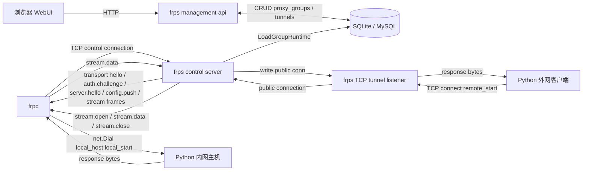
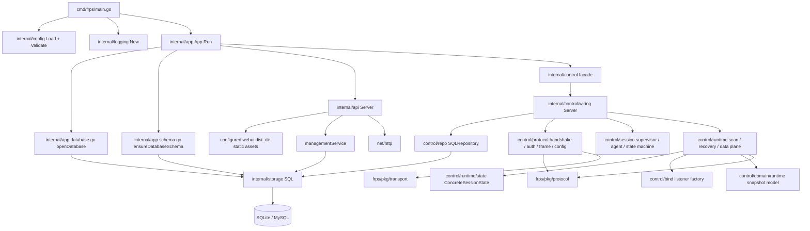
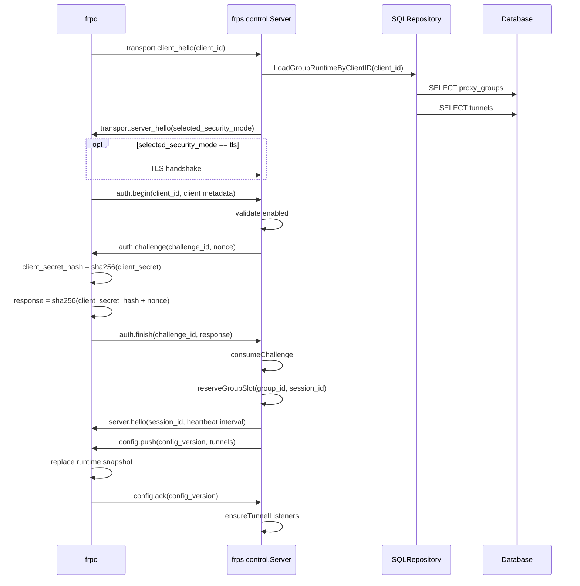
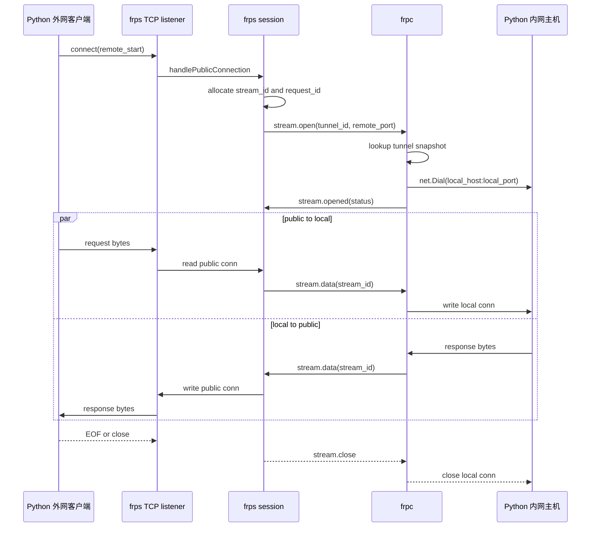
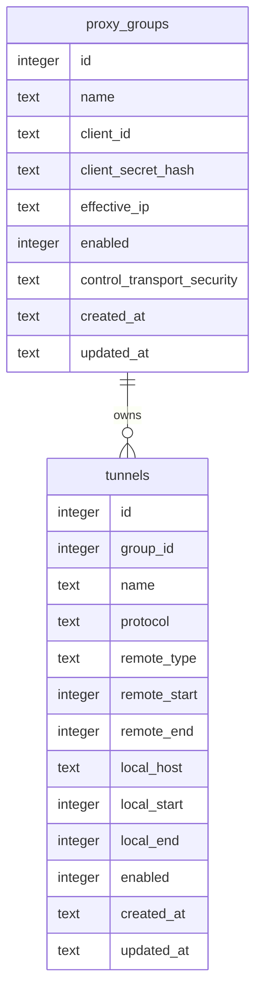

# frps / frpc 当前代码架构图

本文根据当前代码实现绘制，不包含尚未落地的设计目标。代码现状以 `2026-04-29` 的工作区为准。

## 1. 总体运行拓扑

当前已完整跑通的主链路是：

```text
Python 外网客户端 <-> frps <-> frpc <-> Python 内网主机
```



核心边界：

- `frps` 同进程内同时运行管理面 HTTP 服务和 `frpc` 控制连接服务。
- `frps` 的公网隧道监听器由控制会话在收到 `config.ack` 后启动。
- `frpc` 只通过 `--server` 和 `--key` 启动，不保存复杂隧道配置。
- 当前数据面把多个 stream 复用在同一条 `frpc <-> frps` 控制 TCP 连接上，没有单独工作连接池。
- UDP 当前已经具备 `frps` 公网 listener、控制帧桥接、`frpc` 本地 UDP 转发、`frps` 侧空闲 `30s` cleanup，以及 Python happy path / idle cleanup e2e。

## 2. frps 进程内架构



主要职责：

- `cmd/frps/main.go`：零参数启动，固定读取当前工作目录下的 `data/config.json`，加载配置和日志，启动 `app.App`。
- `internal/app`：打开数据库，执行当前必需表建表 / 校验，并并发启动管理面和控制面。
- `internal/api`：提供内嵌 WebUI、健康检查、`proxy_group` CRUD、隧道 CRUD、登录 `key` 重置。
- `internal/control`：根包只保留 app/api 稳定 facade；实际业务由 `wiring` 拼装 `protocol`、`session`、`runtime`、`domain/runtime`、`repo` 和 `bind` 子包。`ConcreteSessionState` 是单 session 控制状态、desired/applied/pending 配置、listener、TCP stream、UDP session 和恢复模式的状态所有者；`session/supervisor` 只负责 group slot、agent 生命周期和事件分发。
- `internal/storage`：包装已打开的 `*sql.DB` / `*sql.Tx`，提供统一查询、执行、事务接口。
- `pkg/protocol`：定义业务帧、消息类型、错误码、隧道结构和编解码，并承接当前唯一新增的跨端共享纯规则 `ChallengeResponse`。
- `pkg/transport`：定义 4 字节长度前缀帧读写、超时和最大帧限制。

## 3. frpc 进程内架构


主要职责：

- `cmd/frpc/main.go`：只接收 `--server` 和 `--key`，日志级别通过 `FRPC_LOG_LEVEL` 控制。
- `internal/config`：校验 server 地址，按固定长度解析 `key` 为 `client_id` 和 `client_secret`。
- `internal/client.Client`：连接 `frps`、登录、断线退避重连、启动读循环和心跳循环。
- `sessionState`：保存配置快照、活跃 stream、活跃 UDP session、心跳间隔、已确认配置版本和写锁。
- `targets.go`：统一 tunnel 查找、本地 target 解析和 range 端口换算。
- `tcp_bridge.go` / `udp_bridge.go`：分别承接 TCP stream 和 UDP session 的本地桥接逻辑。
- `runtime_info.go`：提供主机名、OS、架构等登录期运行时信息。

## 4. 登录和配置下发时序



实际代码约束：

- 数据库保存的是 `client_id` 和 `client_secret_hash`，不会保存 `key` 原文。
- `transport.client_hello` 必须在 `auth.begin` 前到达，服务端会用 hello 中的 `client_id` 决定本连接是否需要升级到 TLS。
- `frpc` 使用 `key` 中的 `client_secret` 计算响应，`frps` 使用数据库中的 `client_secret_hash` 验证响应。
- `sha256(client_secret_hash + nonce)` 这条跨端共享纯规则固定收口到 `frps/pkg/protocol.ChallengeResponse`。
- `frps` 内存中的 `groupSlots` 固定表示每个 `proxy_group` 只有一个已登录客户端槽位。
- 当前配置快照在首次登录和后续在线热重载阶段都会加载并下发；管理面命中运行态字段且 `proxy_group` 在线时，会复用现有 `config.push / config.ack` 主动推进整组热重载。
- 数据库当前只承担持久化配置层；`LoadGroupRuntime` 会在登录时把 `proxy_groups` / `tunnels` 投影成 `GroupRuntime` / `ConfigSnapshot`，之后 `frps` / `frpc` 只消费内存快照。
- 抓包相关控制当前未实现；如果后续引入，应属于运行时配置，不应再作为 `tunnels` 表列。

## 5. TCP 转发时序



当前实际数据面边界：

- `frps` 会为 `enabled` 的 TCP 单端口 / range 隧道，以及 `enabled` 的 UDP 单端口 / range 隧道启动公网 listener。
- `frps` 当前已经能把公网 UDP datagram 按 `tunnelId + remotePort + 公网客户端地址` 绑定到 `sessionId`，并向 `frpc` 顺序发送 `udp.open` / `udp.data`，同时接收来自 `frpc` 的 `udp.data` 回写公网客户端。
- `frps` 是 UDP session 生命周期的唯一裁决方；当前会在公网收包和 `frpc` 回包时立即刷新 UDP session 活跃时间，并由后台短周期 sweep 按 `lastActive + timeout` 裁决空闲会话，在“最后一次成功双向转发后空闲约 `30s`”时删除本地 session、向 `frpc` 发送 `udp.close`。
- `frpc` 当前会在收到 `udp.open` 后按 `sessionId` 建立真实本地 `UDPConn`，收到 `udp.data` 后把 datagram 写到本地 UDP 服务，并由后台读循环把本地响应按同一 `sessionId` 回发给 `frps`。
- `frpc` 当前不做本地 idle timer；只有在收到 `udp.close`、发生本地不可恢复读写错误，或控制会话结束时才释放本地 UDP session。
- TCP/UDP range 当前都已经完成最小闭环：`config.ack` 后 `frps` 会按 `remoteStart..remoteEnd` 展开 TCP/UDP listener，并把实际命中的公网端口写入 `stream.open.remotePort` / `udp.open.remotePort`；`frpc` 则统一按 `offset = remotePort - remoteStart` 计算目标 `localPort`。`test/e2e_tcp_range.py`、`test/e2e_udp_range.py` 和 `test/e2e_udp_single.py` 持续覆盖 range 偏移、单端口不回退和 UDP idle cleanup。当前单端口 TCP / UDP 限速已经进入 `frps` 真实执行链路；隧道入口 ACL、抓包、在线观测等能力仍未进入真实执行链路。

## 6. 数据库模型关系



说明：

- 关系图表达的是当前代码中的逻辑关联，schema 中未声明外键约束。
- `proxy_groups` 和 `tunnels` 是当前 WebUI 和控制面共同使用的核心表。
- 当前已确认的后续限速模型见 [限速策略设计](frps/design/rate-policy.md)；旧的 `proxy_groups.rate_limit` 字段已经从正式 schema 中移除。
- 抓包控制如果后续引入，应放在运行时配置层而不是关系图里的持久化表。
- 当前代码不维护 `schema_migrations` 或独立 schema 版本记录；启动时只校验当前代码依赖的业务表，额外残留表不参与业务关系图。

## 7. 源码依据

- `frps/cmd/frps/main.go`
- `frps/internal/app/app.go`
- `frps/internal/app/database.go`
- `frps/internal/app/schema.go`
- `frps/internal/api/server.go`
- `frps/internal/api/management.go`
- `frps/internal/api/webui.go`
- `frps/internal/control/facade.go`
- `frps/internal/control/wiring/server.go`
- `frps/internal/control/wiring/connection.go`
- `frps/internal/control/wiring/auth.go`
- `frps/internal/control/wiring/configsync_adapter.go`
- `frps/internal/control/wiring/refresh.go`
- `frps/internal/control/wiring/runtime_executor.go`
- `frps/internal/control/wiring/data_plane_adapter.go`
- `frps/internal/control/protocol/`
- `frps/internal/control/session/`
- `frps/internal/control/runtime/`
- `frps/internal/control/runtime/state/types.go`
- `frps/internal/control/repo/`
- `frps/internal/control/bind/`
- `frps/internal/storage/sql.go`
- `frps/pkg/protocol/protocol.go`
- `frps/pkg/transport/transport.go`
- `frpc/cmd/frpc/main.go`
- `frpc/internal/config/config.go`
- `frpc/internal/client/client.go`
- `frpc/internal/client/login.go`
- `frpc/internal/client/session.go`
- `frpc/internal/client/targets.go`
- `frpc/internal/client/tcp_bridge.go`
- `frpc/internal/client/udp_bridge.go`
- `frpc/internal/client/runtime_info.go`
